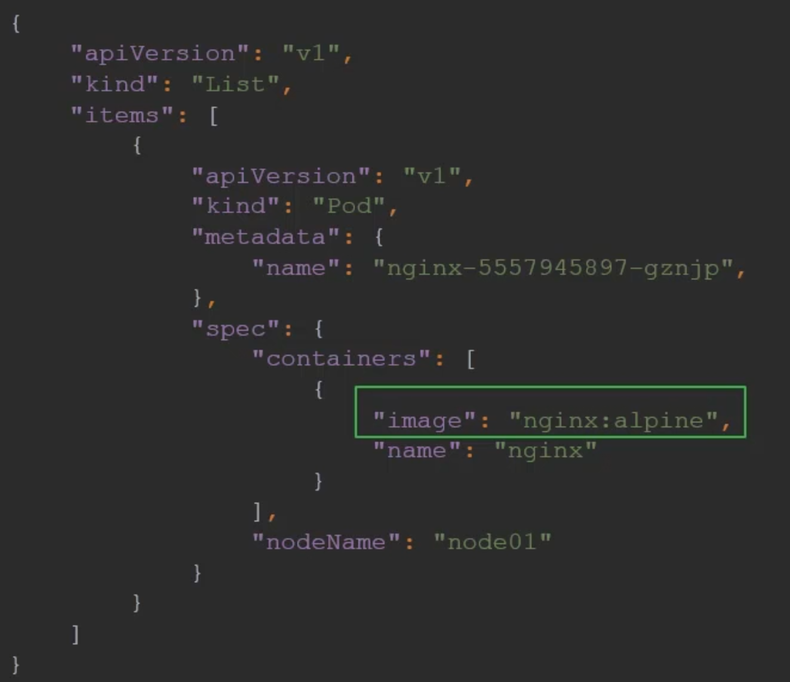
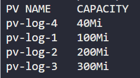

# Certified Kubernetes Administrator (CKA)

## Contents

1. [Core Concepts](https://github.com/bradley-woods/certified-k8s-admin/blob/main/core-concepts.md)
2. [Scheduling](https://github.com/bradley-woods/certified-k8s-admin/blob/main/scheduling.md)
3. [Logging and Monitoring](https://github.com/bradley-woods/certified-k8s-admin/blob/main/logging-and-monitoring.md)
4. [Application Lifecycle Management](https://github.com/bradley-woods/certified-k8s-admin/blob/main/application-lifecycle-management.md)
5. [Cluster Maintenance](https://github.com/bradley-woods/certified-k8s-admin/blob/main/cluster-maintenance.md)
6. [Security](https://github.com/bradley-woods/certified-k8s-admin/blob/main/security.md)
7. [Storage](https://github.com/bradley-woods/certified-k8s-admin/blob/main/storage.md)
8. [Networking](https://github.com/bradley-woods/certified-k8s-admin/blob/main/networking.md)
9. [Cluster Installation](https://github.com/bradley-woods/certified-k8s-admin/blob/main/cluster-installation.md)
10. [Troubleshooting](https://github.com/bradley-woods/certified-k8s-admin/blob/main/troubleshooting.md)

## Kubernetes Shortcuts

To set up a shortcut for the `kubectl` command as `k` and then use auto completion of Kubernetes commands, enter the following:

```bash
source <(kubectl completion bash)
alias k=kubectl
complete -F __start_kubectl k
```

To set up a shortcut for the config command `set-context` use the following:

```bash
alias kcsc="kubectl config set-context"
```

## Kubectl Output Formats

We can get extra details regarding a resource using the `wide` output flag:

```bash
kubectl get <resource> -o wide
```

We can also view the output in JSON format using the `json` output flag:

```bash
kubectl get <resource> -o json
```

This output can then be queried using a JSON Path query, for example:

```bash
kubectl get pods -o jsonpath='{.items[0].spec.containers[0].image}'
```



To search for a specific item use the command: `?(@.search == "item")` as shown, to get the password for the user:

```bash
kubectl config view -o jsonpath='{.users[?(@.name == "user")].user.password}'
```

To format the query into a list with columns use the `range` keyword to create a for-loop:

```bash
kubectl get pv -o jsonpath="{range .items[*]}{.metadata.name}{'\t'}{.spec.capacity.storage}{'\n'}{end}"
```

The output can also be sorted and given custom column headings using the following flags:

```bash
kubectl get pv -o=custom-columns="PV NAME:.metadata.name,CAPACITY:.spec.capacity.storage" --sort-by=.spec.capacity.storage
```


